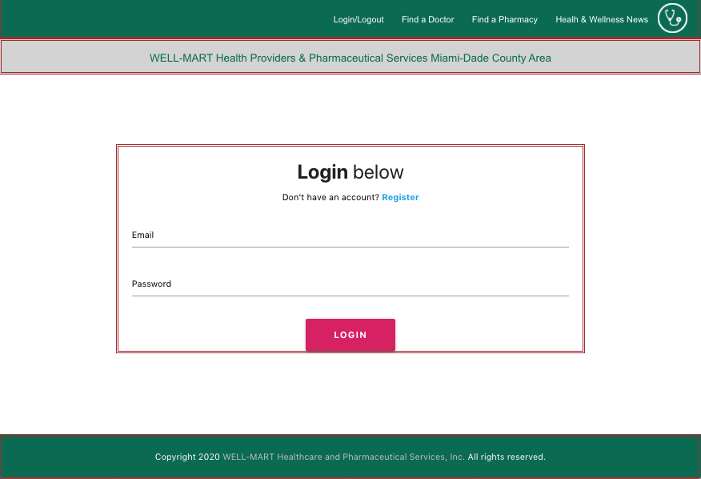
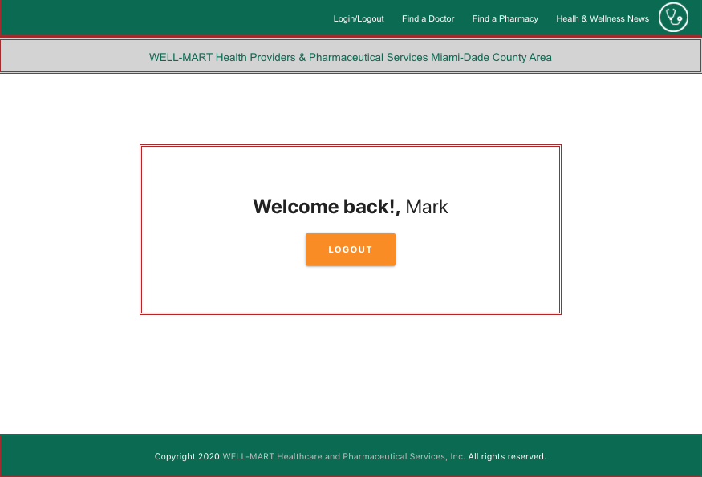
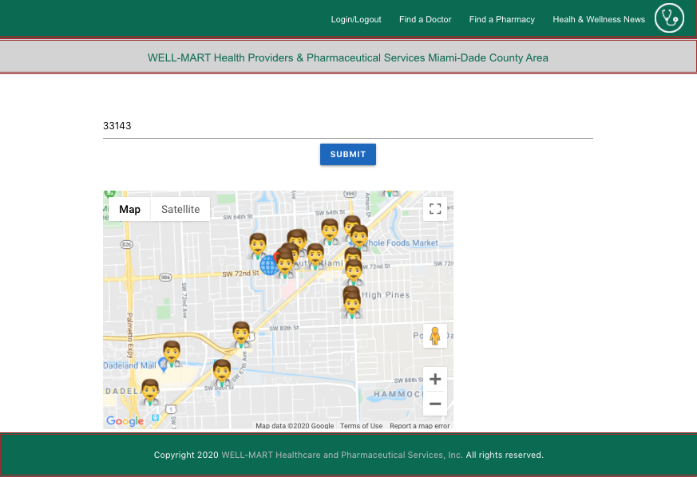
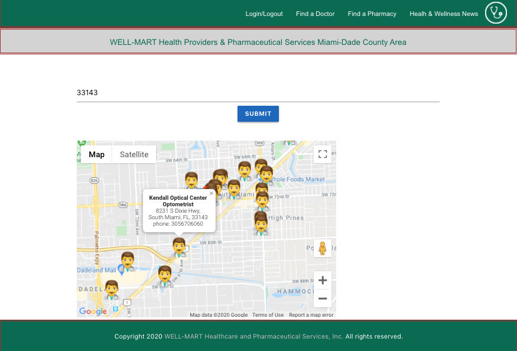
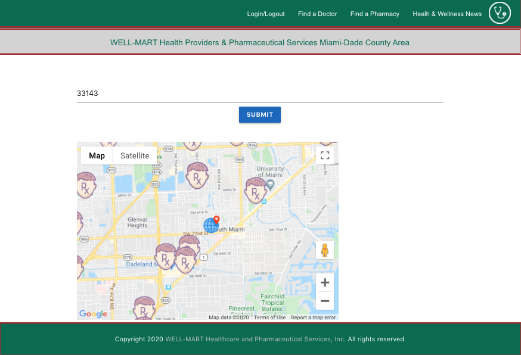
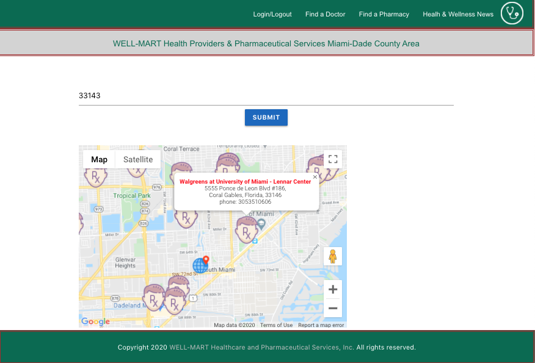
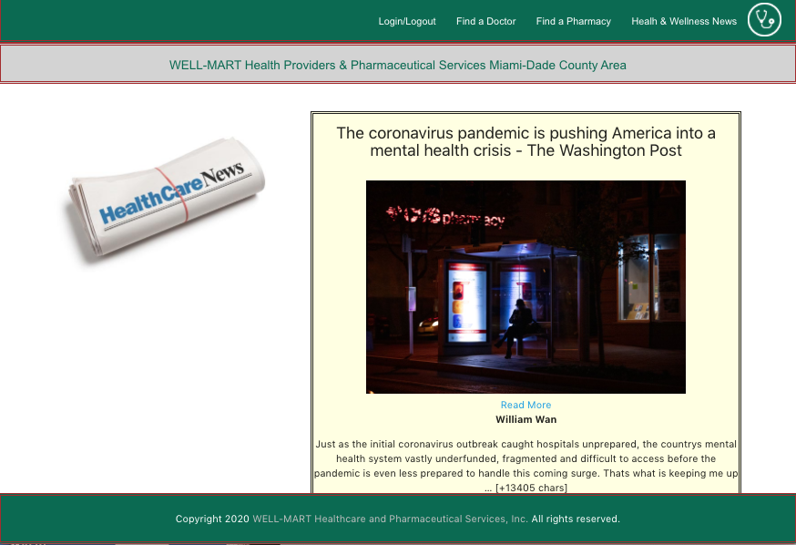

# WellMart #

An innovative website which provides users with the ability to search for local pharmacies and doctors within the Miami-Dade county area. Additionally, this site not only provides local doctor and pharmacy information but also provides the most current health related news.

This app is deployed at:  

This app covered the following requirements:

- React JS
- Node Express Web Server
- User Authentication
- Deployed using Heroku
- Used Materialize and Google Maps React
- Polished Frontend
- Has both GET and POST routes
- Folder structure meets MVC Paradigm
- Backed by Mongo DB Database
- API key not exposed

This app has the following functionalities:

Login Page:

Sucessful Login:

User types a zipcode within the Miami-Dade County area, and results are displayed on a google map where symbols indicate doctor's offices.

When User clicks on any symbol, a completed doctor's information is displayed: 

User types a zipcode within the Miami-Dade County area, and results are displayed on a google map where symbols indicate pharmacy's offices.

When User clicks on any symbol, a completed pharmacy's information is displayed: 

Updated Health's news are also available in the app:

